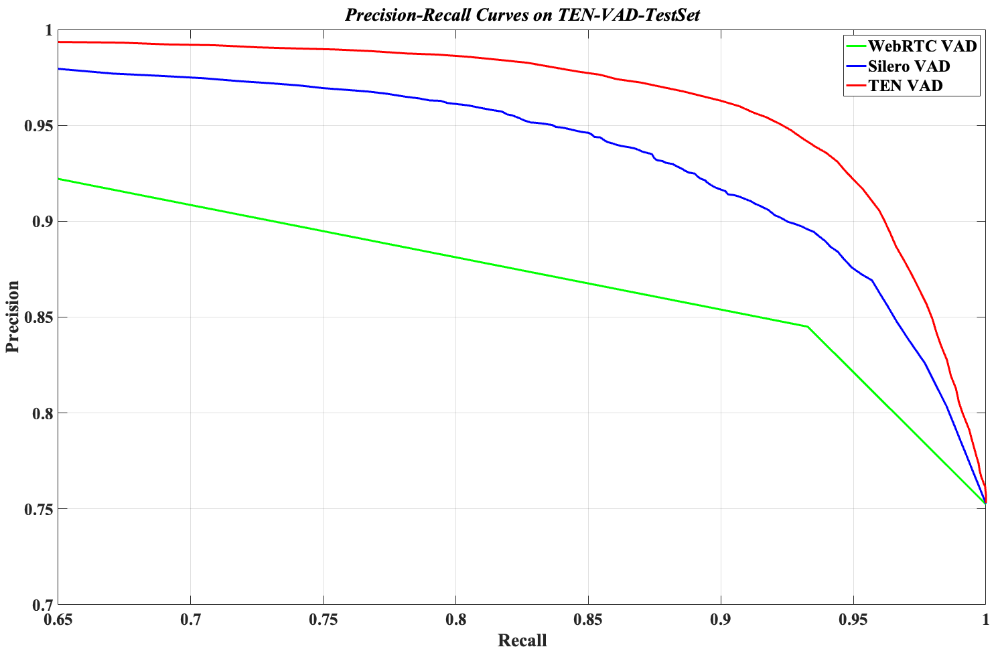
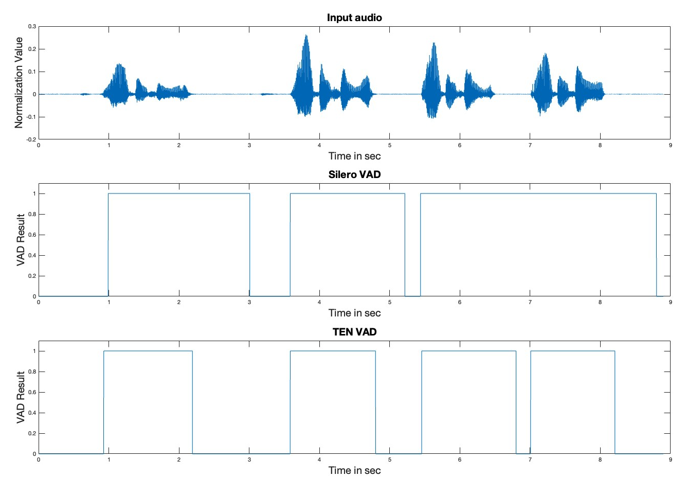

# **TEN VAD**

***A Low-Latency, Lightweight and High-Performance Streaming VAD***


## **Introduction**
**TEN VAD** is a real-time voice activity detection system designed for enterprise use,  providing accurate frame-level speech activity detection. It shows superior precision compared to both WebRTC VAD and Silero VAD, which are commonly used in the industry. Additionally, TEN VAD offers lower computational complexity and reduced memory usage compared to Silero VAD. Meanwhile, the architecture's temporal efficiency enables rapid voice activity detection, significantly reducing end-to-end response and turn detection latency in conversational AI systems.


## **Key Features**

### **1. High-Performance:** 

The precision-recall curves comparing the performance of WebRTC VAD (pitch-based), Silero VAD, and TEN VAD are shown below. The evaluation is conducted on the precisely manually annotated TEN-VAD-TestSet. The audio files are from librispeech, gigaspeech, DNS Challenge etc. As demonstrated, TEN VAD achieves the best performance. Additionally, cross-validation experiments conducted on large internal real-world datasets demonstrate the reproducibility of these findings. The **TEN-VAD-TestSet with annotated labels** is released in directory "TEN-VAD-TestSet" of this repository.

 <br>

<div style="text-align:">
  
</div>

Note that the default threshold of 0.5 is used to generate binary speech indicators (0 for non-speech signal, 1 for speech signal). This threshold needs to be tuned according to your domain-specific task. The precision-recall curve can be obtained by executing the following script on Linux x64. The output figure will be saved in the same directory as the script. Note that only PR curves of Silero VAD and TEN VAD are plotted, we did not plot the one of WebRTC VAD, which is used in the latese version of WebRTC.

```
cd ./examples
python plot_pr_curves.py
```
<br>

### **2. Agent-Friendly:** 
As illustrated in the figure below, TEN VAD rapidly detects speech-to-non-speech transitions, whereas Silero VAD suffers from a delay of several hundred milliseconds, resulting in increased end-to-end latency in human-agent interaction systems. In addition, as demonstrated in the 6.5s-7.0s audio segment, Silero VAD fails to identify short silent durations between adjacent speech segments.
<div style="text-align:">
  
</div>
<br>

### **3. Lightweight:**
We evaluated the RTF (Real-Time Factor) across five distinct platforms, each equipped with varying CPUs. TEN VAD demonstrates much lower computational complexity and smaller library size than Silero VAD.

<table>
  <tr>
    <th align="center" rowspan="2" valign="middle"> Platform </th>
    <th align="center" rowspan="2" valign="middle"> CPU </th>
    <th align="center" colspan="2"> RTF </th>
    <th align="center" colspan="2"> Lib Size </th>

  </tr>
  <tr>
    <th align="center" style="white-space: nowrap;"> TEN VAD </th>
    <th align="center" style="white-space: nowrap;"> Silero VAD </th>
    <th align="center"> TEN VAD </th>
    <th align="center"> Silero VAD </th>
  </tr>
  <tr>
    <th align="center" rowspan="3"> Linux </th>
    <td style="white-space: nowrap;"> AMD Ryzen 9 5900X 12-Core </td>
    <td align="center"> 0.0150 </td>
    <td align="center" rowspan="2" valign="middle"> / </td>
    <td align="center" rowspan="3" valign="middle"> 306KB </td>
    <td align="center" rowspan="9" style="white-space: nowrap;" valign="middle"> 2.16MB(JIT) / 2.22MB(ONNX) </td>
  </tr>
  <tr>
    <td style="white-space: nowrap;"> Intel(R) Xeon(R) Platinum 8253 </td>
    <td align="center"> 0.0136 </td>
  </tr>
  <tr>
    <td style="white-space: nowrap;"> Intel(R) Xeon(R) Gold 6348 CPU @ 2.60GHz </td>
    <td align="center"> 0.0086 </td>
    <td align="center"> 0.0127 </td>
  </tr>
  <tr>
    <th align="center"> Windows </th>
    <td> Intel i7-10710U </td>
    <td align="center"> 0.0150 </td>
    <td align="center" rowspan="6" valign="middle"> / </td>
    <td align="center" style="white-space: nowrap;"> 464KB(x86) / 508KB(x64) </td>
  </tr>
  <tr>
    <th align="center"> macOS </th>
    <td> M1 </td>
    <td align="center"> 0.0160 </td>
    <td align="center"> 731KB </td>
  </tr>
  <tr>
    <th align="center" rowspan="2"> Android </th>
    <td> Galaxy J6+ (32bit, 425) </td>
    <td align="center"> 0.0570 </td>
    <td align="center" rowspan="2" style="white-space: nowrap;"> 373KB(v7a) / 532KB(v8a)</td>
  </tr>
  <tr>
    <td> Oppo A3s (450) </td>
    <td align="center"> 0.0490 </td>
  </tr>
  <tr>
    <th align="center" rowspan="2"> iOS </th>
    <td> iPhone6 (A8) </td>
    <td align="center"> 0.0210 </td>
    <td align="center" rowspan="2"> 320KB</td>
  </tr>
  <tr>
    <td> iPhone8 (A11) </td>
    <td align="center"> 0.0050 </td>
  </tr> 
</table>
<br>

### **4. Multiple programming languages and platforms:**
TEN VAD provides cross-platform C compatibility across five operating systems (Linux x64, Windows, macOS, Android, iOS), with Python bindings optimized for Linux x64.
<br>
<br>


### **5. Supproted sampling rate and hop size:**
TEN VAD operates on 16kHz audio input with configurable hop sizes (optimized frame configurations: 160/256 samples=10/16ms). Other sampling rates must be resampled to 16kHz.
<br>
<br>

## **Installation**
```
git clone https://github.com/TEN-framework/ten-vad.git
```
<br>

## **Quick Start**
The project supports five major platforms with dynamic library linking.
<table>
  <tr>
    <th align="center"> Platform </th>
    <th align="center"> Dynamic Lib </th>
    <th align="center"> Supported Arch </th>
    <th align="center"> Interface Language </th>
    <th align="center"> Header </th>
    <th align="center"> Comment </v>
  </tr>
  <tr>
    <th align="center"> Linux </th>
    <td align="center"> libten_vad.so </td>
    <td align="center"> x64 </td>
    <td align="center"> Python, C </td>
    <td rowspan="5">ten_vad.h <br> ten_vad.py</td>
    <td>  </td>
  </tr>
  <tr>
    <th align="center"> Windows </th>
    <td align="center"> ten_vad.dll </td>
    <td align="center"> x64, x86 </td>
    <td align="center"> C </td>
    <td>  </td>
  </tr>
  <tr>
    <th align="center"> macOS </th>
    <td align="center"> ten_vad.framework </td>
    <td align="center"> arm64, x86_64 </td>
    <td align="center"> C </td>
    <td>  </td>
  </tr>
  <tr>
    <th align="center"> Android </th>
    <td align="center"> libten_vad.so </td>
    <td align="center"> arm64-v8a, armeabi-v7a </td>
    <td align="center"> C </td>
    <td>  </td>
  </tr>
  <tr>
    <th align="center"> iOS </th>
    <td align="center"> ten_vad.framework </td>
    <td align="center"> arm64 </td>
    <td align="center"> C </td>
    <td> 1. not simulator <br> 2. not iPad </td>
  </tr>

</table>
<br>


### **Python Usage**
#### **1. Linux**
#### **Requirements**
- numpy (Version 1.17.4/1.26.4 verified)
- scipy (Version 1.4.1/1.13.1 verified)
- scikit-learn (Version 1.2.2/1.5.0 verified, for plotting PR curves)
- matplotlib (Version 3.1.3/3.10.0 verified, for plotting PR curves)
- torchaudio (Version 2.2.2 verified, for plotting PR curves)

- Python version 3.8.19/3.10.14 verified

Note: You could use other versions of above packages, but we didn't test other versions. 

You can install the above mentioned dependencies via requirements.txt:

```
pip install -r requirements.txt
```
<br>

#### **Usage**
Note: For usage in python, you can either use it by **git clone** or **pip**.

##### **By using git clone:**

1. Clone the repository
```
git clone https://github.com/TEN-framework/ten-vad.git
```

2. Enter examples directory
```
cd ./examples
```

3. Test
```
python test.py s0724-s0730.wav out.txt
```
<br>

##### **By using pip:**

1. Install via pip 

```
pip install -U --force-reinstall -v git+https://github.com/TEN-framework/ten-vad.git
```

2. Write your own use cases and import the class, the attributes of class TenVAD you can refer to ten_vad.py

```
from ten_vad import TenVad
```
<br>

### **C Usage**
#### **Build Scripts**
Located in examples/ directory:

- Linux: build-and-deploy-linux.sh
- Windows: build-and-deploy-windows.bat
- macOS: build-and-deploy-mac.sh
- Android: build-and-deploy-android.sh
- iOS: build-and-deploy-ios.sh

#### **Dynamic Library Configuration**
Runtime library path configuration:
- Linux/Android: LD_LIBRARY_PATH
- macOS: DYLD_FRAMEWORK_PATH
- Windows: DLL in executable directory or system PATH

#### **Customization**
- Modify platform-specific build scripts
- Adjust CMakeLists.txt
- Configure toolchain and architecture settings

#### **Overview of Usage**
- Navigate to examples/
- Execute platform-specific build script
- Configure dynamic library path
- Run demo with sample audio s0724-s0730.wav
- Processed results saved to out.txt

<br>

The detailed usage methods of each platform are as follows <br> 

####  **1. Linux**
##### **Requirements**
- Clang (e.g. 6.0.0-1ubuntu2 verified)
- CMake
- Terminal

##### **Usage**
```
1) cd ./examples
2) ./build-and-deploy-linux.sh
```
<br>

####  **2. Windows**
##### **Requirements**
- Visual Studio (2017, 2019, 2022 verified)
- CMake (3.26.0-rc6 verified)
- Terminal (MINGW64 or powershell)

##### **Usage**
```
1) cd ./examples
2) Configure "build-and-deploy-windows.bat" with your preferred:
    - Architecture (default: x64)
    - Visual Studio version (default: 2019)
3) ./build-and-deploy-windows.bat
```
<br>

####  **3. macOS**
##### **Requirements**
- Xcode (15.2 verified)
- CMake (3.19.2 verified)

##### **Usage**
```
1) cd ./examples
2) Configure "build-and-deploy-mac.sh" with your target architecture:
  - Default: arm64 (Apple Silicon)
  - Alternative: x86_64 (Intel)
3) ./build-and-deploy-mac.sh
```
<br>

####  **4. Android**
##### **Requirements**
- NDK (r25b, macOS verified)
- CMake (3.19.2, macOS verified)
- adb (1.0.41, macOS verified)

##### **Usage**
```
1) cd ./examples
2) export ANDROID_NDK=/path/to/android-ndk  # Replace it with your NDK installation path
3) Configure "build-and-deploy-android.sh" with your build settings:
  - Architecture: arm64-v8a (default) or armeabi-v7a
  - Toolchain: aarch64-linux-android-clang (default) or custom NDK toolchain
4) ./build-and-deploy-android.sh
```
<br>

####  **5. iOS**
##### **Requirements**
Xcode (15.2, macOS verified)
CMake (3.19.2, macOS verified)
##### **Usage**
1. Enter examples directory
```
cd ./examples
```

2. Creates Xcode project files for iOS build
```
./build-and-deploy-ios.sh
```

3. Follow the steps below to build and test on iOS device:

    3.1. Use Xcode to open .xcodeproj files: a) cd ./build-ios, b) open ./ten_vad_demo.xcodeproj

    3.2. In Xcode IDE, select ten_vad_demo target (should check: Edit Scheme → Run → Release), then select your iOS Device (not simulator).

    <div style="text-align:">
      
    </div>

    3.3. Drag ten_vad/lib/iOS/ten_vad.framework  to "Frameworks, Libraries, and Embedded Content"

    - (in TARGETS → ten_vad_demo → ten_vad_demo → General, should set Embed to "Embed & Sign").

    -   or add it directly in this way: "Frameworks, Libraries, and Embedded Content" → "+" → Add Other... → Add Files →...  

    - Note: If this step is not completed, you may encounter the following runtime error: "dyld: Library not loaded: @rpath/ten_vad.framework/ten_vad".

      <div style="text-align:">
        
      </div>

    3.4. Configure iOS device Signature

    - in TARGETS → ten_vad_demo → Signing & Capabilities → Signing

      - Modify Bundle Identifier: modify "com.yourcompany" to yours;

      - Specify Provisioning Profile

    - In TARGETS → ten_vad_demo → Build Settings → Signing → Code Signing Identity:
      - Specify your Certification

    3.5. Build in Xcode and run demo on your device.
<br>

## **Citations**
```
@misc{TEN VAD,
  author = {TEN Team},
  title = {TEN VAD: A Low-Latency, Lightweight and High-Performance Streaming Voice Activity Detector (VAD)},
  year = {2025},
  publisher = {GitHub},
  journal = {GitHub repository},
  howpublished = {https://github.com/TEN-framework/ten-vad.git},
  commit = {insert_some_commit_here},
  email = {developer@ten.ai}
}
```
<br>

## **License**
This project is Apache 2.0 licensed.
